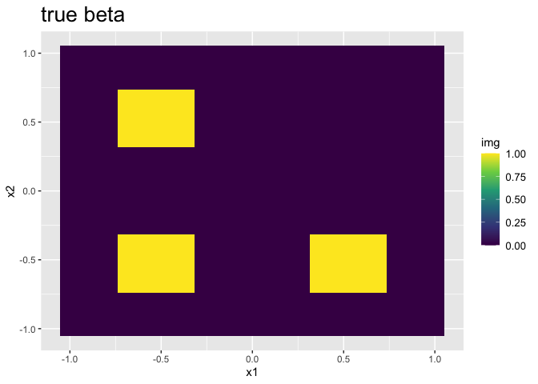
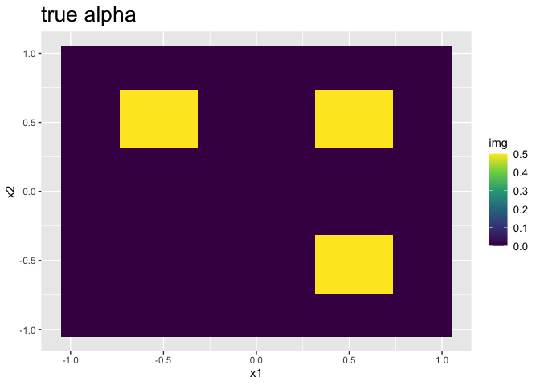
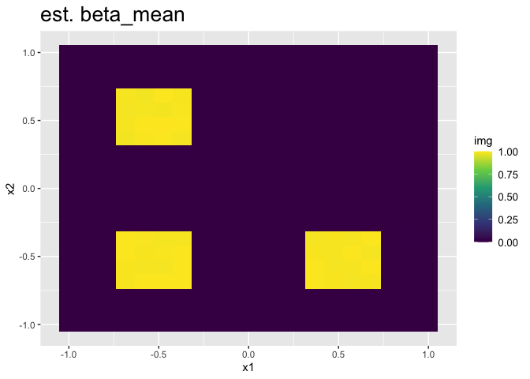
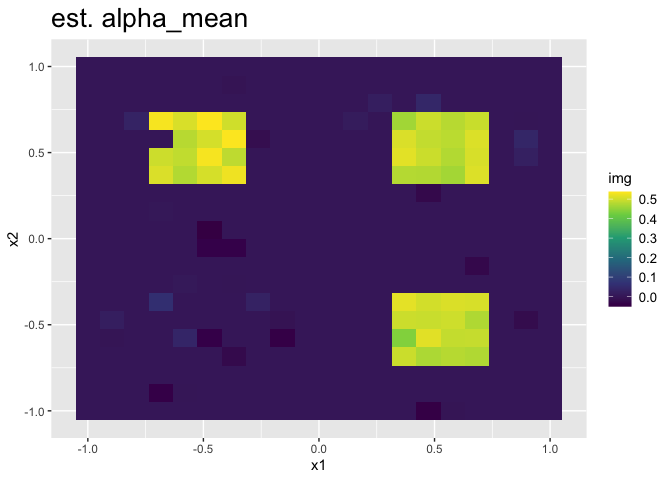
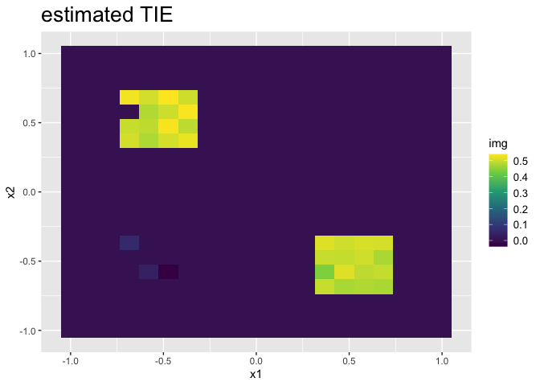

BIMA:Vignette
================
Yuliang Xu
2022-09-11

# Create a testing case

``` r
num_region = 4
side = 20
n = 300
region_idx = vector("list",num_region)
grids = GP.generate.grids(d=2L,num_grids=side)
grids_df = as.data.frame(grids)

idx_mat = matrix(1:(side*side),ncol = num_region)
idx_matr = matrix(1:(side*side),ncol = side)
p_length = NULL
seq_idx = cbind(1:(side/2), (1+side/2):side)
region_idx[[1]] = intersect(idx_matr[seq_idx[,1],],idx_mat[,1:2])
region_idx[[2]] = intersect(idx_matr[seq_idx[,2],],idx_mat[,1:2])
region_idx[[3]] = intersect(idx_matr[seq_idx[,1],],idx_mat[,3:4])
region_idx[[4]] = intersect(idx_matr[seq_idx[,2],],idx_mat[,3:4])
p = dim(grids)[1]


circ_func = function(x,y,r,l=1){
  d = sum((x-y)^2)/l
  if(d>r){z=0}else{z=sqrt(r-d)}
  return(z)
}
quad_func2 = function(x,y,s=0.2,w=1.2){
  d = abs(x-y)
  l = y-w; u = y+w; l=l-w; u=u+w
  # z=1
  if(max(d)<s){z= 1}else{z=1/max(d)*s}
  # if(max(d)>s){z= 0}else{z=1/max(d)*s}
  if(x[1]<l[1] | x[2]<l[2] | x[1]>u[1] | x[2]>u[2]){z = 0}
  return(z)
}
s = c(1,1,1,1)
beta = rep(0,p)
for(i in 1:3){
  g = NULL
  g$center = apply(grids[region_idx[[i]],],2,mean)
  g$grids_std = grids[region_idx[[i]],]
  # beta[region_idx[[i]]] = apply(g$grids_std ,1,circ_func,g$center,r=0.8,l=0.1)/s[i]
  beta[region_idx[[i]]] = apply(g$grids_std ,1,quad_func2,g$center,s=0.2,w=0.1)/s[i]
}


k= c(1,1,1,1)
alpha = rep(0,p)
for(i in 2:4){
  g = NULL
  g$center = apply(grids[region_idx[[i]],],2,mean)
  g$grids_std = grids[region_idx[[i]],]
  alpha[region_idx[[i]]] = apply(g$grids_std ,1,quad_func2,g$center,s=0.2,w=0.1)/k[i]
  # alpha[region_idx[[i]]] = apply(g$grids_std ,1,circ_func,g$center,r=0.8,l=0.1)/k[i]
}


alpha_true = alpha; beta_true = beta


lambda = 0.5
basis_sq = generate_sq_basis(grids, region_idx,a = 0.01,b = 10,poly_degree = 10)
L = length(unlist(basis_sq$Phi_D))

datsim = STGP_generate_theta_block(alpha_true,beta_true, 
                                   2, 0.1, grids, basis_sq$Phi_Q,lambda=lambda,region_idx,basis_sq$L_all,
                                   n.sample=n)
#> [1] "m= 1"
#> [1] "dim(Q[[m]])= 100 ;dim(theta_eta[[m]])= 66"
#> [2] "dim(Q[[m]])= 66 ;dim(theta_eta[[m]])= 300"
#> [1] "m= 2"
#> [1] "dim(Q[[m]])= 100 ;dim(theta_eta[[m]])= 66"
#> [2] "dim(Q[[m]])= 66 ;dim(theta_eta[[m]])= 300"
#> [1] "m= 3"
#> [1] "dim(Q[[m]])= 100 ;dim(theta_eta[[m]])= 66"
#> [2] "dim(Q[[m]])= 66 ;dim(theta_eta[[m]])= 300"
#> [1] "m= 4"
#> [1] "dim(Q[[m]])= 100 ;dim(theta_eta[[m]])= 66"
#> [2] "dim(Q[[m]])= 66 ;dim(theta_eta[[m]])= 300"
datsim$lambda = lambda
plot_img(datsim$beta_test_ST,grids_df = grids_df, "true beta")
```

<!-- -->

``` r
plot_img(datsim$alpha_test_ST, grids_df = grids_df,"true alpha")
```

<!-- -->

# Run Scalar-on-image regression

``` r
init = list(theta_beta = rep(1,L),
          a_sigma_beta = 1, b_sigma_beta = 1,
          D=unlist(basis_sq$Phi_D), # recompute D
          sigma_Y = 1,
          sigma_beta = 1,
          cb = 0 ,
          zetay = rep(1,dim(datsim$C)[1]),
          gamma = 1)# L by n
n_mcmc = 1*1e5
lambda = datsim$lambda
num_block = 4
controls = list(n_mcmc = n_mcmc, 
              stop_burnin = 0.8*n_mcmc,
              start_joint = 0.1*n_mcmc, 
              lambda = lambda,
              interval_step = 10,
              interval_thin = 1,
              step = 1e-2/n)
region_idx_cpp = lapply(region_idx, function(x){x-1})
# Rcpp::sourceCpp("src/Mediation_functions.cpp")
sim64y = Y_regression_region_block_fast(Y = datsim$Y, M = datsim$M,
                                        X = datsim$X, C = t(datsim$C), 
                                        L_all = basis_sq$L_all,
                                        num_region = num_block,
                                        region_idx = region_idx_cpp,n_mcmc = n_mcmc,
                                        basis_sq$Phi_Q, 
                                        stop_burnin = controls$stop_burnin,
                                       start_joint = controls$start_joint, 
                                       lambda = controls$lambda, 
                                       target_accept_vec = rep(0.2,num_block),
                                       a=1,b=1,
                                       init = init,
                                       step = controls$step,
                                       interval_step = controls$interval_step, 
                                       interval_thin = controls$interval_thin)

# plot(sim64y$logll_mcmc_Y)
# plot(sim64y$theta_beta_mcmc_thin[1,])
```

# Run Image-on-scalar regression

``` r
n = dim(datsim$M)[2]
p = dim(datsim$M)[1]
L = length(datsim$theta_alpha)
m = dim(datsim$C)[1]
# note that in GS version, Image on scalar regression, zeta_m is implemented as a scalar instead of spatially-varying vector
gs64m = M_regression_GS(datsim,
                        init = list(zetam=rep(1,m), sigma_alpha = 0.1,sigma_M=0.1,
                                    theta_eta = matrix(0,nrow = L, ncol=n),sigma_eta= 1,
                                    theta_alpha= rep(0.5,L),
                                    cb=1,a=1,b=2,sigma_zetam=0.1),
                        region_idx_cpp,
                        kernel = list(Q = basis_sq$Phi_Q, D = basis_sq$Phi_D),
                        n_mcmc = 400)
print("GS for M ....")
#> [1] "GS for M ...."
gs_burn = 370:400
init = list(
  theta_alpha =  apply(gs64m$theta_alpha_mcmc[,gs_burn],1,mean),
  D=unlist(basis_sq$Phi_D), # recompute D
  theta_eta = gs64m$theta_eta,
  sigma_M = mean(1/sqrt(gs64m$sigma_M2_inv_mcmc[gs_burn])),
  sigma_alpha = mean(1/sqrt(gs64m$sigma_alpha2_inv_mcmc[gs_burn])),
  sigma_eta = mean(1/sqrt(gs64m$sigma_eta2_inv_mcmc[gs_burn])),
  theta_zetam = matrix(rep(0.1,L*m),L,m))
# n_mcmc = 1*1e5
n_mcmc = 2e4
lambda = datsim$lambda
num_block = 4
print("MALA for M ....")
#> [1] "MALA for M ...."
sim64m = M_regression_region_block(datsim$M,
                                   datsim$X, t(datsim$C), basis_sq$L_all,
                                   num_region = num_block ,
                                   region_idx = region_idx_cpp,
                                   n_mcmc = n_mcmc , 
                                   basis_sq$Phi_Q, 
                                   stop_burnin = ceiling(n_mcmc*0.7),
                                   lambda = datsim$lambda, 
                                   target_accept_vec = rep(0.2,num_block),
                                   init = init,
                                   interval = 10, # adjust step every 10 iter
                                   interval_eta = 1000,
                                   step = 1e-2/n)
```

# Summarize and visualize results

``` r
n_mcmc = dim(sim64y$theta_beta_mcmc_thin)[2]
theta_sample = sim64y$theta_beta_mcmc_thin[, ceiling(n_mcmc*0.8):n_mcmc]
beta_sample = STGP_mcmc(theta_sample,region_idx,basis_sq,lambda = datsim$lambda)
n_mcmc = dim(sim64m$theta_alpha_mcmc)[2]
theta_sample = sim64m$theta_alpha_mcmc[,ceiling(n_mcmc*0.9):n_mcmc]
alpha_sample = STGP_mcmc(theta_sample,region_idx,basis_sq,lambda = datsim$lambda)

beta_sample_thin = beta_sample[,seq(1,dim(beta_sample)[2],length.out = dim(alpha_sample)[2])]
total_sample = beta_sample_thin*alpha_sample
datsim$total_test_ST = datsim$alpha_test_ST*datsim$beta_test_ST

plot_img(apply(beta_sample_thin,1,mean),
         as.data.frame(grids), "est. beta_mean")
```

<!-- -->

``` r
plot_img(apply(alpha_sample,1,mean),
         as.data.frame(grids), "est. alpha_mean")
```

<!-- -->

``` r

inclusion_map_tuned = InclusionMap(total_sample,datsim$total_test_ST,fdr_target=0.1)
#> [1] "fdr= 0.114285714285714 thresh= 0.5"
#> [1] "fdr= 0.114285714285714 thresh= 0.55"
#> [1] "fdr= 0.114285714285714 thresh= 0.605"
#> [1] "fdr= 0.114285714285714 thresh= 0.6655"
#> [1] "fdr= 0.114285714285714 thresh= 0.73205"
#> [1] "fdr= 0.114285714285714 thresh= 0.805255"
#> [1] "fdr= 0.114285714285714 thresh= 0.885780500000001"
#> [1] "fdr= 0.0882352941176471 thresh= 0.974358550000001"
inclusion_map = InclusionMap(total_sample,datsim$total_test_ST,thresh=0.5)
TIE = rep(0,p)
S_idx = which(inclusion_map_tuned$mapping==1)
S_null = which(datsim$total_test_ST==0)
S_nonnull = which(datsim$total_test_ST!=0)
TIE[S_idx] = apply(total_sample[S_idx,],1,function(a){mean(a[(abs(a))>0])})

plot_img(TIE, grids_df,"estimated TIE")
```

<!-- -->

``` r

sum_TIE = matrix(NA, nrow=1,ncol=5)
colnames(sum_TIE) = c("FDR","Power","Precision","MSE_null","MSE_nonnull")
sum_TIE[1,1] = FDR(TIE,datsim$total_test_ST)
sum_TIE[1,2] = Power(TIE,datsim$total_test_ST)
sum_TIE[1,3] = Precision(TIE,datsim$total_test_ST)
sum_TIE[1,4] = mean((TIE[S_null] - datsim$total_test_ST[S_null])^2)
sum_TIE[1,5] = mean((TIE[S_nonnull] - datsim$total_test_ST[S_nonnull])^2)
sim_result = NULL
sim_result$sum_TIE = sum_TIE
knitr::kable(sim_result)
```

|       FDR |   Power | Precision | MSE_null | MSE_nonnull |
|----------:|--------:|----------:|---------:|------------:|
| 0.0882353 | 0.96875 |      0.99 | 1.67e-05 |   0.0082604 |
